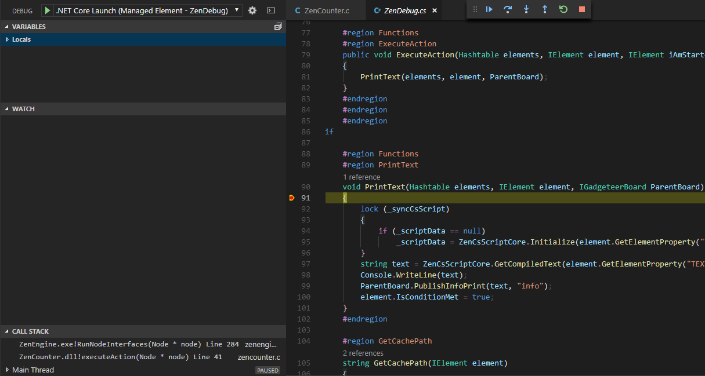
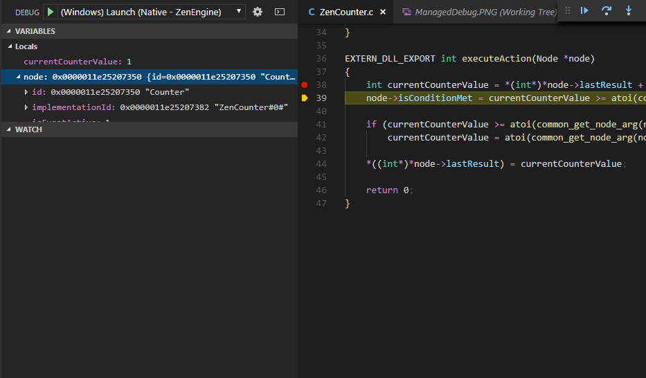

# ZenUnmanaged

Zenodys is Visual Development Tool and Computing Engine used in IoT and Industry 4.0 fields.<br/>
This repository contains native C Computing Engine implementation and Elements.
 
# Table of contents

- [Motivation](#motivation)
- [Vision](#vision)
- [Current State](#current-state)
- [Getting Help](#getting-help)
- [Contributions](#contributions)
- [Architecture](#architecture)
  - [Visual Development Tool](#visual-development-tool)
  - [ZenEngine](#zenengine)
  - [ZenCommon](#zencommon)
  - [Bindings](#bindings)
- [Build Instructions](#build-instructions)
  - [Overview](#overview)
  - [Required skills](#required-skills)
  - [Building and Debugging managed Elements on Windows](#building-and-debugging-managed-elements-on-windows)
  - [Building and Debugging managed Elements on Linux](#building-and-debugging-managed-elements-on-linux)
- [Credits and Licence](#credits-and-licence)

# Motivation
We all have bunch of digital and analog assets. But the main problem is that most of us don’t have the required knowledge to gather and put them into some standard tradeable  form.<br/><br/>
On the other side  - the demand side - companies need large amounts of  data (from data for predictive maintenance purposes to heartbeat data in medical industry) that just can’t acquire.<br/><br/> Those problems motivate us to create a digital assets marketplace where everyone are able to trade their assets.

# Vision
Our vision is to build a decentralized digital assets marketplace with help of blockchain technology that would allow a transparent and fair rewards system. No matter if we are programmers or not. The marketplace will be driven by our advanced Visual IoT/Industry 4.0 platform which will be open sourced
# Current State
We started to transfer platform from private to public repositories.<br/>The platform contains two main parts, Visual Development Tool that is browser based IDE for creating projects and Computing Engine, microservice orchestration tool that executes visual scripts made in IDE on edge devices.<br/>This repo contains the Computing Engine and Elements (microservices). The Computing Engine is completely transferred and Elements will be added gradually.
<br/>Next step is to open source the Visual Development Tool. 

# Getting Help
For technical help, or general discussion, please use the [Telegram Channel](https://t.me/zenodysico).

# Contributions
Digital Assets is wide term. It can be anything in digital or analog form - from real time streams, historical data, files..  to more advanced assets like algorithms, microservices, dApps, UI’s…

Contributors can be divided into the following categories:
* Non technical and Business Developers. These contribute by creating workflows in the Visual Development Tool. They trade created workflows or can use them to gather other digital assets, like data, and trade those gathered assets.
* Technical users with basic programming knowledge that are creating advanced workflows. Platform contains Elements where snippets of code in different languages can be entered into their properties. This offers a  higher degree of flexibility and can cover most complex scenarios. It is a perfect sweet spot between simplicity and flexibility.
*  Element creators, programmers that use programming tools to create standardised microservices for Computing Engine. If you are reading this on github, then that’s you :)

All contributors will be fairly rewarded along the entire  value chain. For example, the creator of an advanced predictive maintenance algorithm is automatically awarded each time his Element is used in a project. All users are rewarded by their shares of contributions  if more than one works on the same digital asset.

You can get more in-depth here:
* [Technical Whitepaper](https://zz.zenodys.com/zenodys-technical-whitepaper.pdf)
* [Protocol Specification](https://zz.zenodys.com/zenodys-protocol.pdf)
* [Medium Article](https://medium.com/@zenodys/trade-your-digital-assets-in-under-10-mouse-clicks-9b2e8bfdb60b)
* [Business Whitepaper](https://zz.zenodys.com/zenodys-whitepaper.pdf)
* [Youtube Presentation](https://www.youtube.com/watch?v=MEHJErxozqE)

# Architecture

## Visual Development Tool
Browser based IDE for developing and debugging Visual Scripts. Scripts are manually or remotely transferred to ZenEngine (Computing Engine).
## ZenEngine
[Computing Engine](ZenEngine) runs on edge devices and executes Visual Scripts. Edge device can be any Linux or Windows machine. This can be small embedded device like Raspberry or virtual machine hosted on Azure. It just depends on project requirements.  
## ZenCommon
[ZenCommon](ZenCommon) is glue between Elements and Computing Engine. Elements are isolated units that are not directly referenced and do not depends on ZenEngine. ZenCommon is abstract layer between Elements and ZenEngine. 
## Bindings
Bindings to different programming languages in which Elements for native Computing Engine can be written. Currently [.NET Core CLR](libs/ZenCoreCLR) binding exists, but others will be added gradually. 
## C/C++ Elements
[Native Elements](Elements) are microservices handled and executed by Computing Engine. Element can be simple (counter, digital input...), or complex (AI algorithm, ZWave protocol...) 
## .NET Core Elements
[Managed Elements](https://github.com/Zenodys/ZenDotNet/tree/develop/Elements) are similar to Native but developed on .NET Core platform


# Build Instructions
## Overview
To successfully build project you’ll need to install several tools. One of them is Visual Studio Code which is very light and powerful cross platform IDE for building and debugging Elements on Linux, macOS and Windows platforms. Same tool will be used for debugging both, native and managed Elements.<br/><br/>
Along with tools, you’ll also need Visual Script made in Visual Development Tool. Script is premade to get you started quickly. After completing environment setup for building and debugging Elements, you will probably want to experiment with your own Visual Scripts inside Visual Development Tool. IDE is not open sourced yet and is currently available at https://app.zenodys.com<br/>
You can request login to insider preview on our [Telegram Channel](https://t.me/zenodysico) <br/><br/>
For the sake of simplicity, pre-made Visual Script is simple loop that writes current counter value to console window.<br/><br/>

<br/><br/>
Knowing what script does is not crucial for setting up environment and start debugging Elements, but here is quick info for those curious:
* Loop entry point is “Start” Element
* Then it moves to “Counter” Element that has two outputs, red and green. If condition is satisfied (counter reach some value), then workflow proceed to green connection, otherwise to red. It’s safe to connect just red connection in this example, because value is set high.
* Next Element in workflow is “Debug” and prints current “Counter” value
* “Sleep” Element stops loop for 1 second and after that steps are repeated

<br/><br/>
“Start”, “Counter” and “Sleep” Elements in this loop are native, and “Debug” is managed.
<br/><br/>
Special tags exists inside Zenodys platform. One of them is “result” tag that allow sharing results between Elements. Here is example of “Debug” Element text property:<br/><br/>


## Required skills
Computing Engine is written in native C and supports Elements written in C/C++ and .NET Core (both can be mixed inside same project in Visual Development Tool by end user).<br/>
.NET Core Element developers doesn’t have to have C/C++, and C/C++ developers doesn’t have to have .NET Core knowledge to create Elements.<br/><br/>
Developing .NET Core Elements is simple, but some basic understanding of C# and Object Oriented Programming Concepts is needed. Although raw pointers are passed from Computing Engine, they are needed just in [managed binding layer](https://github.com/Zenodys/ZenDotNet/tree/develop/ZenCommon/NetCore) which acts like wrapper between managed and unmanaged code. This layer offers abstraction from managed to native Elements so that they are able to share state between each others.
 
Here is example of simple Element that writes string on Console:

```csharp
// Needed in all Elements. Inits unmanaged Elements so that can be accessed from managed code.
// It can be copy/pasted to each new Element. Just note to change ZenDebug type to new one
unsafe public static void InitUnmanagedElements(
    string currentElementId,
    void** elements,
    int elementsCount,
    int isManaged,
    string projectRoot,
    string projectId,
    ZenNativeHelpers.GetElementProperty getElementPropertyCallback,
    ZenNativeHelpers.GetElementResultInfo getElementResultInfoCallback,
    ZenNativeHelpers.GetElementResult getElementResultCallback,
    ZenNativeHelpers.ExecuteElement executeElementCallback,
    ZenNativeHelpers.SetElementProperty setElementProperty,
    ZenNativeHelpers.AddEventToBuffer addEventToBuffer)
{
    if (!_implementations.ContainsKey(currentElementId))
        _implementations.Add(currentElementId, new ZenDebug());

    ZenNativeHelpers.InitUnmanagedElements(
        currentElementId,
        elements,
        elementsCount,
        isManaged,
        projectRoot,
        projectId,
        getElementPropertyCallback,
        getElementResultInfoCallback,
        getElementResultCallback,
        executeElementCallback,
        setElementProperty,
        addEventToBuffer);
}

// It can be copy/pasted to each new Actionable type Element.
// But instead of PrintText, call your function
unsafe public static void ExecuteAction(
    string currentElementId,
    void** elements,
    int elementsCount,
    IntPtr result)
{
    // Call PrintText function
    _implementations[currentElementId].PrintText(
        ZenNativeHelpers.Elements,
        ZenNativeHelpers.Elements[currentElementId] as IElement,
        ZenNativeHelpers.ParentBoard);
    
    // Return some status to Computing Engine
    ZenNativeHelpers.CopyManagedStringToUnmanagedMemory(string.Empty, result);
}

// Element specific function. Put simple (like reading from file system) 
// or complex (predictive maintenance algorithms) logic here. 
// At this point you are part of Zenodys ecosystem
// You can share result with other Elements, adopt workflow execution to current conditions, 
// change properties of other Elements and much more 
void PrintText(Hashtable elements, IElement element, IGadgeteerBoard ParentBoard)
{
    // GetElementProperty returns property value that user set on Visual Development Tool
    string text = element.GetElementProperty("TEXT");
    Console.WriteLine(text);
    element.IsConditionMet = true;
}
```
And here is example of simple Counter Element written in C:
```c
// Called for Elements that needs to init some values
EXTERN_DLL_EXPORT int onNodePreInit(Node* node)
{
    node->lastResult = malloc(sizeof(int*));
    *node->lastResult = malloc(sizeof(int));
    *((int*)*node->lastResult) = atoi(common_get_node_arg(node, "INITIAL_VALUE"));
    node->lastResultType = RESULT_TYPE_INT;
    return 0;
}

// Called for Actionable Elements.
EXTERN_DLL_EXPORT int executeAction(Node *node)
{
    int currentCounterValue = *(int*)*node->lastResult + atoi(common_get_node_arg(node, "COUNTER_STEP"));
    node->isConditionMet = currentCounterValue >= atoi(common_get_node_arg(node, "MAX_VALUE"));

    if (currentCounterValue >= atoi(common_get_node_arg(node, "MAX_VALUE")))
        currentCounterValue = atoi(common_get_node_arg(node, "INITIAL_VALUE"));

    *((int*)*node->lastResult) = currentCounterValue;
    
    return 0;
}

```

Note that there are more callbacks from Computing Engine (in both implementations, C and .NET Core) that are adding additional flexibility to overall system and will be explained in depth in technical documentation.

## Building and Debugging managed Elements on Windows
Prerequisites:
* git
* Visual Studio Code
* .NET Core SDK
* OpenSSL
* Build Tools For Visual Studio

1. Install [git](https://git-scm.com/downloads)
2. Install [Visual Studio Code](https://code.visualstudio.com/)
After installation, Visual Studio Code will automatically detect git path. In case that path is not detected and git is installed, set path VS Code manually. Install two VS Code extensions
   - Microsoft C/C++ Extension for VS Code
   - "C# for Visual Studio Code (powered by OmniSharp)


3. If you don’t have Visual Studio, install [Build Tools for Visual Studio 2017](https://www.visualstudio.com/downloads/)
   - After running installer, select “Visual C++ build tools”
   - Be sure to select “VC++ 2015.3 v14.00 toolset for desktop” (actual version can slightly vary)

4. Install [OpenSSL](http://slproweb.com/products/Win32OpenSSL.html).  “Win64 OpenSSL v1.0.2o Light” should suffice

5. Install [.NET Core SDK](https://www.microsoft.com/net/download/windows)

6. Create new folder for project. Make sure that path does not contain white spaces (eg C:\Zenodys)

7. Go into newly created folder and clone [ZenDotNet](https://github.com/Zenodys/ZenDotNet.git) repo. This repo contains .NET Core Elements.<br/>
git clone --recurse-submodules  https://github.com/Zenodys/ZenDotNet.git

8. Clone [ZenUnmanaged]( https://github.com/Zenodys/ZenUnmanaged.git) repo. This repo contains native Computing Engine and Elements<br/>
git clone --recurse-submodules https://github.com/Zenodys/ZenUnmanaged.git

9. Go to ZenEngine root dir and rename “project_test” directory to “project”. This is directory that contains pre-made Visual Script. You will probably need to change path of your .NET Core SDK installation directory. To do this, find Settings.ini file and change the “path” value of “NetCore” setting.
 
10. Create two environment variables:
    - ZENO_ROOT pointing to root folder (eg C:\Zenodys)
    - ZENO_PROJ pointing to project folder (eg C:\Zenodys\ZenEngine\project\9024bb0d-137e-4a99-2167-7b5875404b01)<br/><br/>
Restart computer.

11. Now you must build projects.<br/>Open “ZenHelloWorld.code-workspace” in VS Code and press Ctrl+Shift+B to open Build task. Build projects in following order:
      - Native - ZenCommon
      - Managed - ZenCommon
      - Native Lib - ZenCoreCLR
      - Native Element - ZenCounter
      - Native Element - ZenSleep
      - Native Element - ZenStart
      - Native Element -ZenDebugWrapper
      - Managed Element - ZenDebug
      - Native - ZenEngine

11. Start Debugging Managed Elements<br/>
If everything went well, you should be able to start debugging managed and native Elements.<br/>
To start debugging managed Elements press Ctrl+Shift+D to open Debug console.<br/>
Select launch of “Managed Element - ZenDebug”, place breakpoint somewhere in code and start debugging. Breakpoint will hit and you should see something like this:<br/><br/>


12. Start Debugging Native Elements<br/>
Press  Ctrl+Shift+D again to open Debug console.<br/>
Select launch of “Native - ZenEngine”. Open “Native Element - ZenCounter” project, place breakpoint somewhere inside “ZenCounter.c” file and start debugging. Breakpoint will hit and you should see something like this:<br/><br/>


## Building and Debugging managed Elements on Linux
Coming Soon

# Credits and Licence

Code is distributed under GPL3.0 Licence (see LICENCE.md)
Elements and/or Computing Engine includes following libraries :
- Nethereum, https://github.com/Nethereum/Nethereum
- Base64 encode/decode, https://github.com/littlstar/b64.c
- cJSON, https://github.com/DaveGamble/cJSON
- dirent, https://github.com/tronkko/dirent
- ini, https://github.com/rxi/ini
- paho.mqtt, https://github.com/eclipse/paho.mqtt.c, under EPL-1.0 licence
- zip, https://github.com/kuba--/zip/tree/master/src


